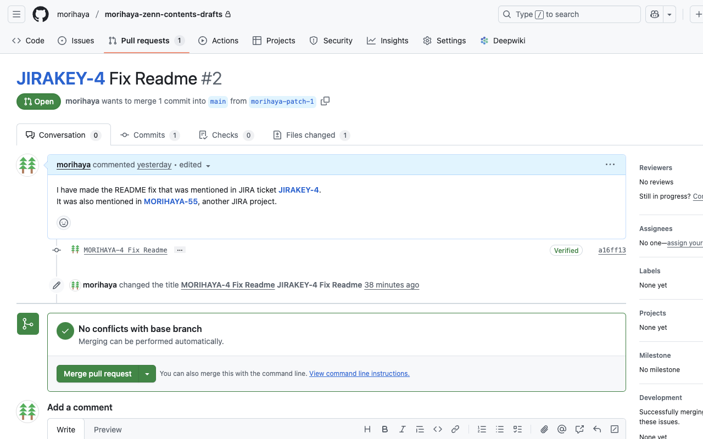
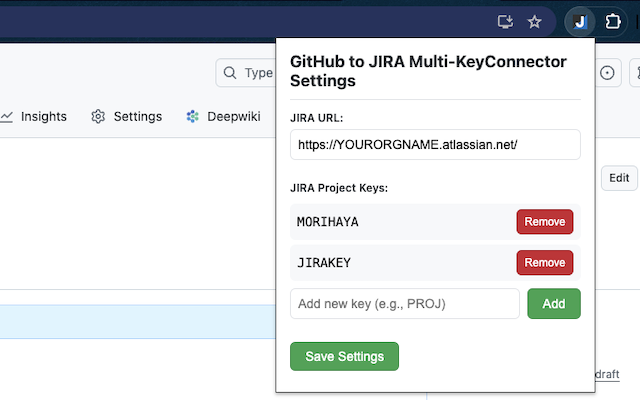

# GitHub to JIRA Multi-KeyConnector

[](https://github.com/morihaya/GitHub-to-JIRA-Multi-KeyConnector/actions/workflows/ci.yml)
[](https://codecov.io/gh/morihaya/GitHub-to-JIRA-Multi-KeyConnector)

A Microsoft Edge and Chrome extension that automatically converts JIRA issue codes (like PROJECT-123) to clickable links in GitHub Pull Request reviews and Issue pages. The extension enables one-way linking from GitHub to JIRA with support for multiple project keys.




## Features

- Converts JIRA issue codes to clickable links in GitHub Pull Request and Issue pages
- Customizable JIRA instance URL
- Support for multiple JIRA project keys
- Settings are saved across browser sessions

## Setup Instructions

1. Load the extension in Microsoft Edge:
   - Open Edge and navigate to `edge://extensions/`
   - Enable "Developer mode" using the toggle in the bottom-left corner
   - Click "Load unpacked" and select this directory

2. Configure the extension:
   - Click on the extension icon in your browser's toolbar
   - Set your JIRA URL (default is `https://YOURORGNAME.atlassian.net/`)
   - Add your JIRA project keys (e.g., PROJECT, FEAT, BUG)
   - Click "Save Settings"

3. Navigate to any GitHub Pull Request or Issue page, and JIRA issue codes will be automatically converted to clickable links

## Notes for Production Use

- For production use, convert the SVG icons in the `/images` folder to PNG files
- You can use the included `icon_generator.html` file to create proper PNG icons

## Development

### Prerequisites
- Node.js (version 18 or higher)
- npm (usually comes with Node.js)

### Setup Development Environment

1. Clone the repository
2. Run `npm install` to install dependencies
3. Run `npm run test` to run the tests
4. Run `npm run test:coverage` to generate test coverage reports
5. Run `npm run lint` to lint the code

### Testing

The project uses Jest for unit testing:

- `npm run test` - Run all tests
- `npm run test:coverage` - Run tests and generate coverage reports (found in the `/coverage` directory)

Tests are organized in the `/tests` directory:
- `content.test.js` - Tests for GitHub content page functionality
- `popup.test.js` - Tests for extension popup functionality
- `navigation.test.js` - Tests for GitHub page navigation detection
- `popup_additional.test.js` - Additional tests for popup functionality
- `mutation_observer.test.js` - Tests for dynamic content observation

### Building for Release

To create a zip file for uploading to the Chrome Web Store or Edge Add-ons:

```bash
npm run zip
```

This creates `extension.zip` containing only the files needed for the extension (manifest.json, content.js, popup.html, popup.js, styles.css, images/).

### Continuous Integration

This project uses GitHub Actions for continuous integration:

- Automated tests run on every push and pull request on Node.js 18.x and 20.x
- Code quality is checked through ESLint
- Test coverage reports are uploaded to Codecov
- Build artifacts are generated on successful merges to main

## Troubleshooting

### Content Security Policy (CSP) Issues

- If you see CSP-related errors in the console about favicon loading, this is expected behavior due to GitHub's security restrictions
- The extension uses `rel="noopener noreferrer"` on generated links to prevent these issues
- The extension functionality should still work properly even if these warnings appear

## License

This software is licensed for use as is. This software comes with no warranty.
